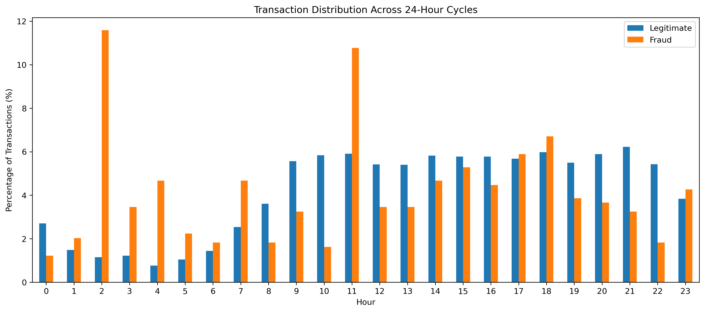
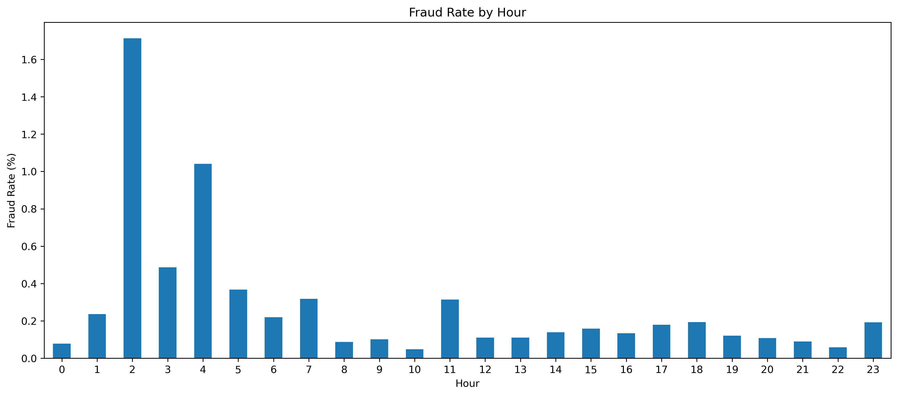
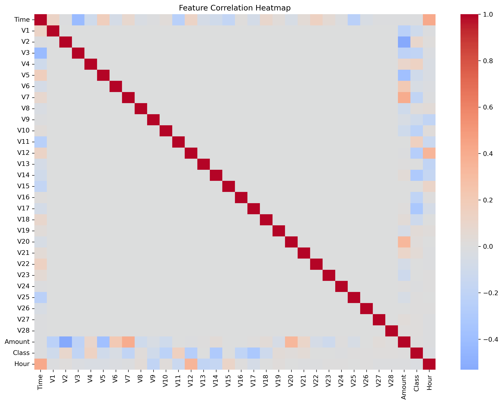
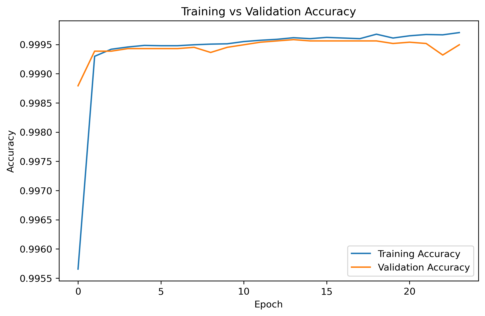
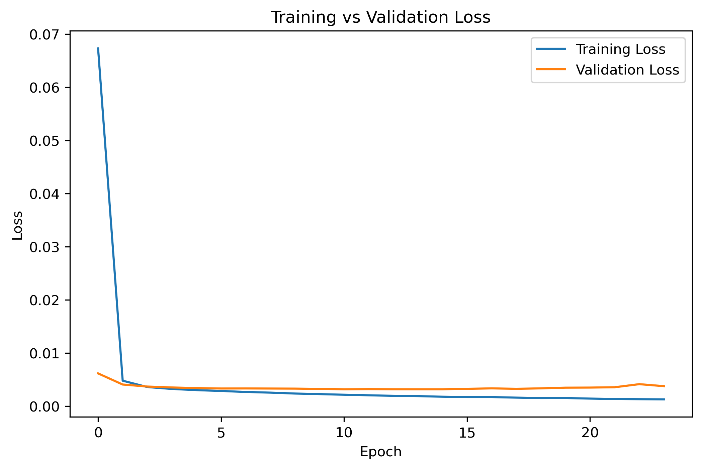
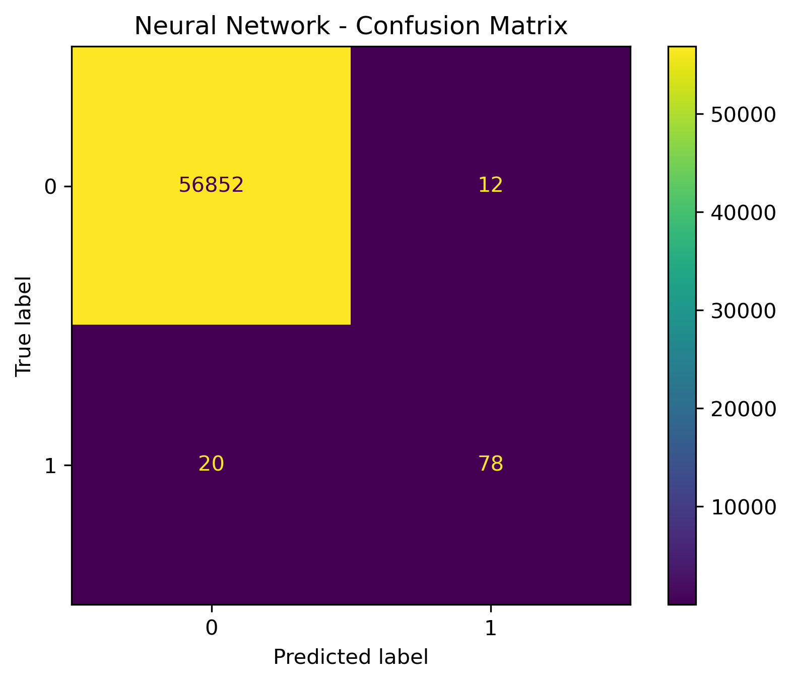

# Credit Card Fraud Detection

A machine learning project for detecting fraudulent credit card transactions using exploratory data analysis, classical classification models, and a neural network.

---

## Project Overview

Credit card fraud detection is a binary classification problem where the goal is to distinguish between legitimate and fraudulent transactions.

This project focuses on understanding the dataset through exploratory data analysis (EDA), preparing the data appropriately for machine learning, and comparing traditional classification models with a neural network.

The project follows a complete machine learning workflow:

**EDA → Preprocessing → Classical ML Models → Neural Network → Evaluation → Model Comparison**

The main goal is not only to build models with strong performance, but also to understand the reasoning behind each step of the machine learning process.

---

## Dataset

The dataset contains credit card transactions with the following main features:

* `Time` — elapsed time since the first transaction in the dataset.
* `V1`–`V28` — anonymized PCA-transformed features.
* `Amount` — transaction amount.
* `Class` — target variable:

  * `0` → Legitimate transaction
  * `1` → Fraudulent transaction

The dataset is highly imbalanced, with fraudulent transactions representing a very small proportion of the total transactions.

> **Note:** The original dataset is not included in this repository.

---

# Exploratory Data Analysis

The EDA focused on understanding the structure of the data, class distribution, feature distributions, temporal patterns, and relationships between features and the target.

## Key Findings

* The dataset is highly imbalanced, with fraud representing a small minority of transactions.
* No missing values were found.
* Duplicate records were checked.
* `Amount` has a skewed distribution with extreme values.
* Fraudulent and legitimate transactions show noticeable differences in the distributions of several `V` features.
* Fraudulent transactions occur across multiple hours rather than being concentrated in a single time period.
* Fraud rates vary across hours, with the highest rate observed at **Hour 2 (1.71%)**, followed by **Hour 4 (1.04%)**.
* Correlation analysis showed that `V17`, `V14`, `V12`, and `V10` have the strongest linear associations with the target.
* Several features have weak or near-zero linear correlations with `Class`; however, weak correlation does not necessarily mean that a feature is uninformative, since nonlinear relationships and feature interactions may still contain useful information.

---

## EDA Visualizations

### Transaction Amount Distribution


### Transaction Count by Hour

.png)

### Transaction Distribution by Hour



### Fraud Rate by Hour



### Feature Correlation with Target



---

# PCA-Transformed Features

The `V1`–`V28` features are anonymized PCA-transformed features provided in the dataset.

PCA reduces the original feature space into new components that are largely uncorrelated with one another.

Because the original feature meanings are not provided, the `V` features are treated as numerical predictive features rather than being assigned specific real-world interpretations.

---

# Feature Selection

The initial modeling feature set consists of:

* `V1`–`V28`
* `Amount`
* `Hour`

The original `Time` feature is excluded from the initial modeling feature set because `Hour` was derived from transaction time and provides a more direct representation of time-of-day patterns.

Features are not removed solely based on their individual correlation with the target, since useful predictive information may exist through nonlinear relationships and interactions between multiple features.

---

# Machine Learning Approach

The project compares three classification approaches:

* Logistic Regression
* Random Forest
* Neural Network

The goal was not only to achieve high predictive performance, but also to understand how different models perform on a highly imbalanced fraud detection problem.

---

## Baseline Models

Two classical machine learning models were first trained as baselines:

* **Logistic Regression**
* **Random Forest**

These models provided a reference point for evaluating the performance of the Neural Network.

---

# Feature Importance & Model Interpretation

One of the most interesting parts of this project was exploring **feature importance** for the first time.

After training my first machine learning model, the **Random Forest**, I examined which features contributed the most to its predictions:

```python
feature_importance = pd.Series(
    Random_Forest_Model.feature_importances_,
    index=x_train.columns
).sort_values(ascending=False)

feature_importance
```

The most important features were:

| Feature | Importance |
| ------- | ---------: |
| V17     |     19.91% |
| V14     |     13.29% |
| V12     |     10.05% |
| V11     |      7.31% |
| V10     |      7.13% |

## EDA Findings Confirmed by the First ML Model

One of the most exciting outcomes was seeing that my **EDA analysis was supported by my first machine learning model**.

During EDA, I investigated the relationship between the features and the target `Class`. The features `V17`, `V14`, `V12`, `V11`, and `V10` showed some of the strongest relationships with the target.

After training the Random Forest, these same features appeared among the **most important features used by the model**.

I also visualized their distributions across legitimate and fraudulent transactions and found noticeable differences between the two classes.

This gave me a strong progression:

**EDA → Identified potentially important features → Visualized their distributions → Trained the first ML model → Feature importance supported the EDA findings**

This was especially meaningful because the model was trained independently of my earlier conclusions.

It gave me evidence that the patterns I noticed during EDA were not simply observations in isolation — they contained useful predictive information for the classification task.

> **Note:** Correlation and Random Forest feature importance measure different things. Correlation measures the strength of a linear relationship with the target, while feature importance reflects how useful a feature was to the Random Forest when making predictions. Therefore, their values should not be compared directly.

---

## Feature Importance Visualization

> **Important:** Feature importance does not mean that these features causally cause fraud. It indicates that the Random Forest relied more heavily on these features when making its predictions.

---

# A Personal Learning Moment

This was my **first time using feature importance**, and honestly, it blew my mind.

Seeing the Random Forest independently identify `V17`, `V14`, `V12`, `V11`, and `V10` as highly important after I had already noticed similar patterns during EDA was one of the most exciting moments of this project.

It made the connection between **data exploration and machine learning** feel much more real to me.

For the first time, I wasn't just:

> *"I trained a model and got 99.96% accuracy."*

I was actually asking:

> *"What did my model learn, and does it agree with what I discovered during EDA?"*

And seeing that my **EDA analysis was supported by my first ML model** was a genuinely rewarding moment in my learning journey.

---

# Neural Network

A fully connected neural network was developed for the binary classification task.

The architecture consists of:

* Input layer matching the number of selected features
* Dense layer with 64 neurons and ReLU activation
* Dense layer with 32 neurons and ReLU activation
* Dense layer with 16 neurons and ReLU activation
* Output layer with 1 neuron and Sigmoid activation

Conceptually:

```text
Input Features
      ↓
Dense (64) + ReLU
      ↓
Dense (32) + ReLU
      ↓
Dense (16) + ReLU
      ↓
Dense (1) + Sigmoid
      ↓
Fraud Probability
```

The model was compiled using:

* **Adam optimizer**
* **Binary Cross-Entropy loss**
* **Accuracy as a training metric**

---

# Preprocessing

The preprocessing pipeline included:

1. Separating the features (`X`) from the target (`y`).
2. Splitting the data into training and testing sets.
3. Scaling the numerical features for the Neural Network.
4. Using a validation split during Neural Network training.
5. Ensuring that the scaler was fitted only on the training data to avoid data leakage.

The dataset's severe class imbalance was considered throughout the evaluation process.

In this baseline version, no advanced class-balancing strategy such as class weighting or resampling was applied.

---

# Training and Validation

The training data was further divided into training and validation subsets.

The validation set was used to monitor how well the model generalized to unseen data during training, while the test set remained untouched until final evaluation.

Early Stopping was used to monitor validation accuracy. If the validation performance stopped improving for a specified number of epochs, training was stopped and the best model weights were restored.

## Training vs Validation Accuracy



The training and validation accuracy increased during the early epochs and then stabilized.

This indicates that the model improved during the initial stages of training and eventually reached a stable performance level.

## Training vs Validation Loss



The training and validation loss decreased during training before reaching a stable point.

Loss measures how far the model's predictions are from the true labels. While accuracy measures how many predictions are correct, the loss also reflects how confident the model is in its predictions.

The similar behavior of the training and validation curves suggests that there was no obvious divergence between training and validation performance.

---

# Model Evaluation

Because the dataset is highly imbalanced, accuracy alone is not sufficient for evaluating fraud detection performance.

The models were evaluated using:

* Accuracy
* Precision
* Recall
* F1-score
* Confusion Matrix

Particular attention was given to **Recall for the fraud class**, since false negatives represent fraudulent transactions that the model failed to detect.

---

# Neural Network Results

After training, the Neural Network was evaluated on the unseen test set.

The model outputs a probability between 0 and 1 through the Sigmoid activation function.

A threshold of `0.5` was used to convert these probabilities into binary predictions:

```python
y_pred = (y_pred_prob >= 0.5).astype(int)
```

The Neural Network achieved:

| Metric    |      Score |
| --------- | ---------: |
| Accuracy  | **99.96%** |
| Precision | **94.05%** |
| Recall    | **80.61%** |
| F1-score  | **86.81%** |

---

# Confusion Matrix

The Neural Network produced the following confusion matrix:

|                       | Predicted Legitimate | Predicted Fraud |
| --------------------- | -------------------: | --------------: |
| **Actual Legitimate** |               56,859 |               5 |
| **Actual Fraud**      |                   19 |              79 |



This means that the model correctly identified **79 out of 98 fraudulent transactions**, while **19 fraudulent transactions were classified as legitimate**.

Only **5 legitimate transactions** were incorrectly classified as fraudulent.

---

# Model Comparison

The three models were evaluated on the same test set:

| Model               |   Accuracy |  Precision |     Recall |   F1-score |
| ------------------- | ---------: | ---------: | ---------: | ---------: |
| Logistic Regression |     99.94% |     86.67% |     79.59% |     82.98% |
| Random Forest       |     99.92% |     82.89% |     64.29% |     72.41% |
| Neural Network      | **99.96%** | **94.05%** | **80.61%** | **86.81%** |

The Neural Network achieved the best overall results among the tested models, particularly in Precision and F1-score.

However, these results should be interpreted carefully because of the severe class imbalance in the dataset.

The comparison also shows why accuracy alone can be misleading for fraud detection. Despite all three models achieving very high accuracy, their ability to detect fraudulent transactions differed considerably.

---

# Future Improvements

This project currently represents a **baseline implementation** and can be further developed as my understanding of machine learning and neural networks grows.

Future versions may explore:

* Class weighting
* Threshold tuning
* Dropout and regularization
* Hyperparameter optimization
* Precision-Recall AUC (PR-AUC)
* More advanced neural network architectures
* Additional techniques for handling highly imbalanced datasets

The goal is to revisit this project later and improve the baseline using techniques that I have developed a deeper understanding of.

Rather than implementing advanced techniques without fully understanding them, this version focuses on building a strong foundation and understanding each step of the workflow.

---

# Project Structure

```text
credit-card-fraud-detection/

│
├── images/
│   ├── Distribution of Transaction Amount.png
│   ├── Transaction Count By Hour (Legitimate vs Fraud).png
│   ├── transaction_distribution_by_hour.png
│   ├── fraud_rate_by_hour.png
│   ├── correlation_heatmap.png
│   ├── random_forest_feature_importance.png
│   ├── training_validation_accuracy.png
│   ├── training_validation_loss.png
│   └── neural_network_confusion_matrix.png
│
├── notebook/
│   └── project.ipynb
│
├── .gitignore
├── README.md
└── requirements.txt
```

> The original dataset is not included in the repository.

---

# Technologies

* Python
* Pandas
* NumPy
* Matplotlib
* Seaborn
* Scikit-learn
* TensorFlow / Keras

---

# Goal

The goal of this project is to build a reliable fraud detection classification pipeline while developing a deeper understanding of:

* Exploratory data analysis
* Feature preprocessing
* Imbalanced classification
* Classical machine learning
* Neural networks
* Model evaluation for fraud detection
* Model interpretation
* Comparing different machine learning approaches

---

# Conclusion

This project was an important step in my machine learning learning journey because it allowed me to go beyond simply training models and looking at their accuracy.

Throughout the project, I practiced and learned about:

* Exploratory Data Analysis
* Data visualization
* Feature-target relationships
* Data preprocessing and feature scaling
* Train, validation, and test splitting
* Logistic Regression
* Random Forest
* Neural Network architecture
* Dense layers
* ReLU and Sigmoid activation functions
* Binary Cross-Entropy loss
* Adam optimizer
* Epochs and batch size
* Validation and Early Stopping
* Probability-based predictions
* Confusion Matrix
* Precision, Recall, and F1-score
* Model comparison
* Feature importance and model interpretation

One of the most meaningful parts of the project was discovering the connection between my EDA findings and the Random Forest feature importance results.

It helped me understand that machine learning is not only about obtaining a high score, but also about asking:

> **"What did my model learn, and does it agree with what I discovered during EDA?"**

The Neural Network achieved the best overall performance among the tested models, with an **F1-score of 86.81%**, **94.05% precision**, and **80.61% recall** on the test set.

This project is not intended to be a final or production-ready fraud detection system. Instead, it represents a **strong baseline that can continue to evolve** as I learn more advanced machine learning and deep learning techniques.

I plan to revisit this project in the future and experiment with more advanced approaches for handling class imbalance, improving recall, tuning decision thresholds, and optimizing the neural network.

For me, the most valuable outcome of this project was not only the final model performance, but everything I learned while building it.

---

`Basmala Hussein`

**An aspiring ML Engineer**
